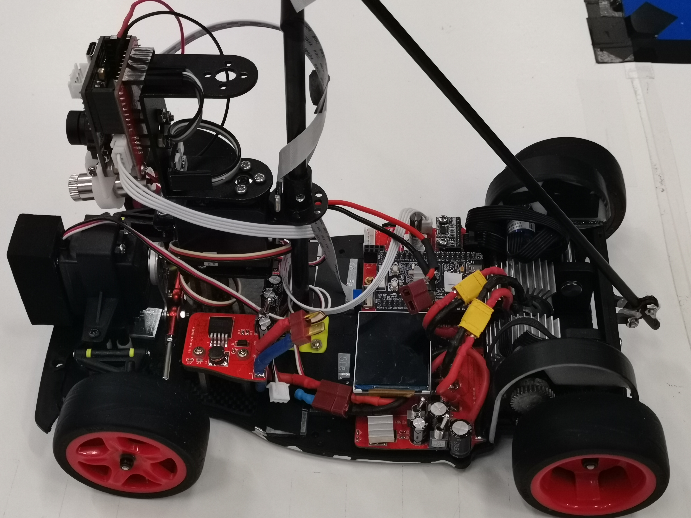
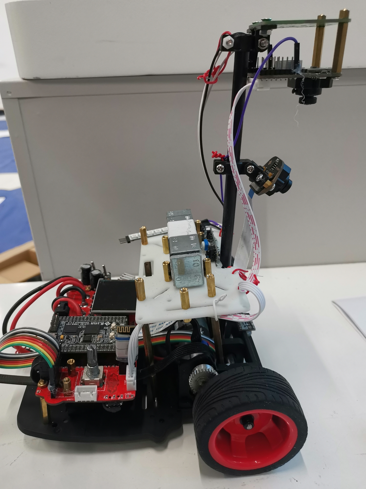
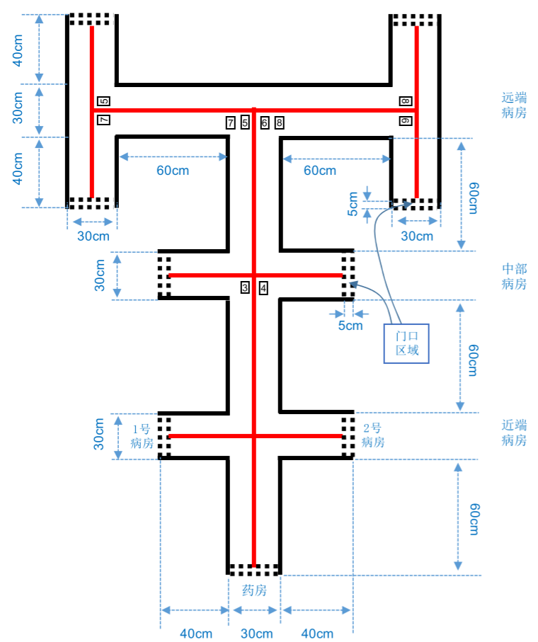
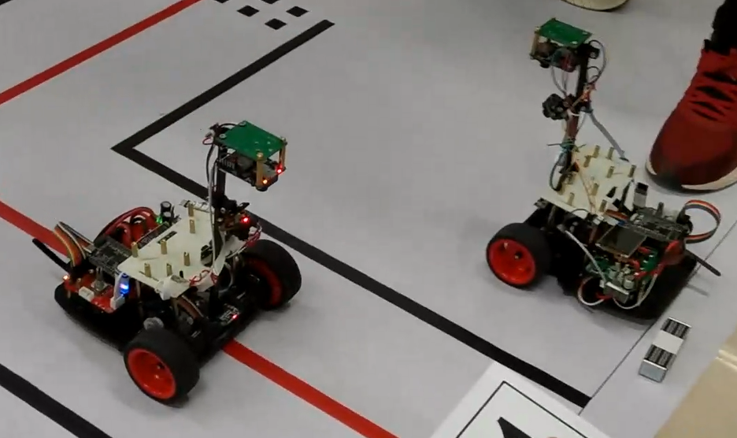
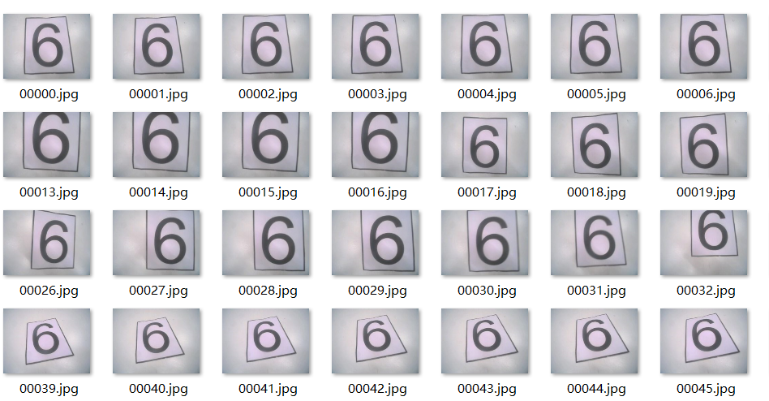
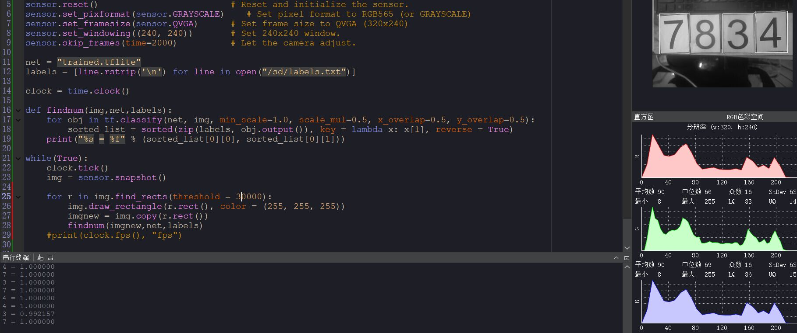
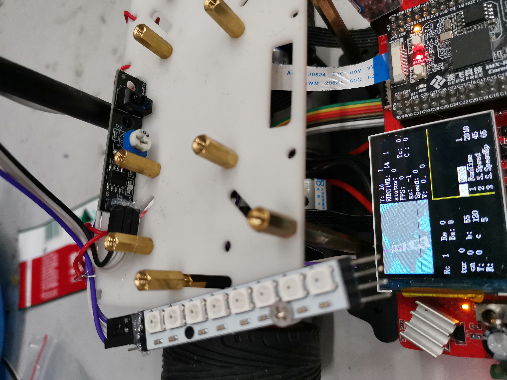
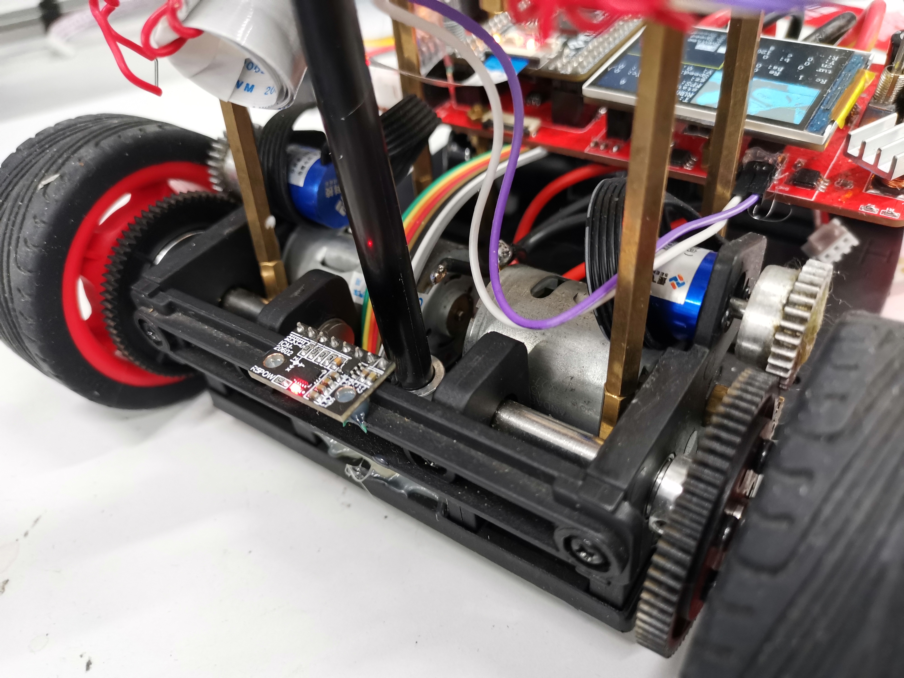
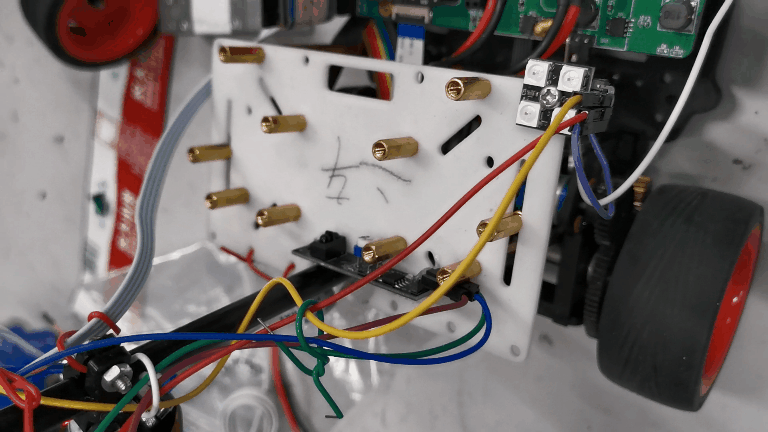
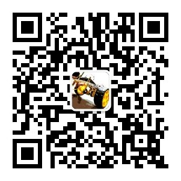

我们是来自天津大学的大三学生区梓川、王鹏昊、成冠松，在今年电赛F题拿到国赛一等奖的成绩。
# 比赛回顾
视频号视频

测试情况是基础题满分，提高一中两车在药房处有出界，（可能是场地两边有桌子挡住光线，场景偏暗导致不能及时识别出停车区）；提高二中一车跑完全程，但二车却在十字停下不跑了（可能是减速减多了，也可能是抢修时哪里损坏了），带着遗憾结束了初评。

好在今年F题选的人很多，国奖名额也比较多，圆了我们电赛国一的梦想。

我们之前拿过16届智能车智能视觉组的国一，有了一定的调车经验，它的任务和电赛F题可以说很像，都需要循迹、识别数字、做出反应，我们的核心板、主板、镜头等硬件都是从这台车上拆下来的。






# 赛题分析

基础题是做一辆送药小车，在药房处得到药和目标病房号，出发送药并返回。近端病房的病房号是确定的，中端远端则是裁判设置的，需要小车在对应路口进行数字识别才能找到方向。

发挥题需要两辆小车，做出了基础题，复刻一辆小车，加上通讯模块，再更改一下逻辑，差不多就可以完成了。

主要有三个难点：红线循迹、启程返程通讯的逻辑、多数字识别。我们意识到这和今年智能车竞赛智能视觉组的任务难点、软件硬件上都有很大的重合，队员恰好做过这个组别，很多资源就可以搬过来用了。


# 方案-双摄三轮车
我们的主控用的是RT1064，它的主频有600M，智能车竞赛做的一套主板硬件、程序框架都可以移植过来。

针对红线循迹，我们采用逐飞的凌瞳彩色摄像头，我们在赛前已经移植好驱动，可以直接调用。

对于数字识别我们选用了OpenART，这是针对神经网络模型开发的强化版OpenMV，装上130°无畸变镜头，同时识别四个数字不是问题。

我们选用智能车的直立车模，在底部安装牛眼轮改为三轮车，将电机端设为前端方便转向，控制也较为简单。

由于药品重量非考察重点，用红外对管识别即可。信号灯颜色控制可用WS2812集成彩灯，对于micro-python只需调用库即可。



具体分工是，OpenART负责数字识别、药品取放识别、信号灯颜色控制，RT1064负责红线循迹、双车通讯、电机控制。

启动小车，放置药品后，OpenART开始识别数字，将结果发送到RT1064，随后小车启动。

当遇到十字或T字路口（近端病房除外），小车减速，RT1064通知OpenART进行数字识别，识别数字的数量、值、方向，再得到反馈回来的左转、右转或直行信息，将其存入**转向数组**。

需要转向时，RT1064控制两轮等速反转，原地旋转90°或180°，用陀螺仪闭环控制，转向完毕后继续前进。

当到达病房时，小车停下，OpenART检测药品被取走，则通知RT1064返回，这时从**转向数组**中依次取出转向信息，在每个路口做对应的转向或直行，即可回到药房。


## 数字识别-OpenART
由于识别数字目标本身带有矩形框，所以我们数字识别采用先识别矩形框，再在框内进行目标分类（MobileNet v2）的方法，相比常用的目标检测算法，提高了运行速度，满足小车的快速识别需求。

由于在小车前进过程中需要完成识别任务，所以我们使用openART现场采集每个数字不同角度800余张的图片素材进行训练（如下图），尽量贴近小车实际运行时所采集的图片，并在OpenART上搭建了MobileNet V2网络，通过调整宽度因子降低模型的参数量，在模型中嵌入通道和空间注意力模块，增强网络对特征的细化能力，设计多尺度特征融合结构，增强网络对尺度的适应性；利用迁移学习的方式优化模型参数，进一步提高模型的精度。



我们使用了130°无畸变镜头，手举OpenART到二十多厘米的高度就可以同时拍到四个平放的数字，不需要分别进行识别，只需在十字或T字前及时减速，OpenART就可以知道接下来要左转、右转还是直行。



## 红线循迹-凌瞳彩色摄像头

由彩色摄像头得到一帧160x120的RGB图像，但由于RGB颜色与亮度相关，三个分量相关性很大，要想提取图像中的红色需要对三个通道同时设置阈值，非常复杂，实测效果也不理想，所以我们先将初始图象从RGB色域转换为LAB色域。

参考文章
```
https://blog.csdn.net/weixin_44349732/article/details/104062757
```

Lab颜色空间是由CIE(国际照明委员会)制定的一种色彩模式，L通道代表亮度，A通道从正到负代表从红色到绿色，B通道从正到负代表从黄色到蓝色。

转换之后，我们得到的160x120图像数组每一个点都带有LAB三通道信息，我们遍历数组，对A通道设置过滤阈值，就可以知道图像中所有红点的位置。

对于直行轨迹，我们对每一行红色点坐标的平均值作最小二乘法，得到其斜率和截距，可以进一步算出小车的轨迹。



桌上放着农夫山泉包装，屏幕上的紫线是拟合出的中线。

对于十字路口和T字路口，我们统计每一行的红色点数量，其大于一定值时判断为路口，这时可执行减速、直行或转向操作。

对于病房停车区的黑色方块，不能通过ab通道将其区分，我们用L通道亮度设定阈值，L值低的像素为黑色，L值高的像素为白色，统计每行黑白像素边沿数量，边沿出现较多的行标记为停车线，再取视野最近的停车线，当期小于一定值时判定可停车，等待药品被取走。

但这样停车线判定与亮度相关，我们在测评时场地较暗，不能及时识别出停车线，导致冲过病房停车线才能停下。

## 路口转向-陀螺仪

我们采用icm20602陀螺仪作闭环转向，由于小车可以根据中心红线自动回正，转向不必过于精确，当需要转向90°或180°时，我们直接取z轴角速度并对其积分，转到目标角度后停止旋转，继续前进。



## 信号灯-ws2812

由于任务中需要有红、绿、黄三种颜色，若用io口接led灯，可能有接线不可靠、驱动力不足、占用io等问题，这里我们用WS2812来实现，只需为其提供5V电压，接上OpenART一个引脚即可切换三种颜色（若驱动电压不足，模块可能会乱闪，我们只亮其中一个），非常方便。

## 药品识别

由于药品可自制，重量不是考察重点，故我们用铁块配重自制了小型药品，通过红外模块检测药品是否放置或取走，进而控制小车出发和返程。



# 运行逻辑
## 任务执行逻辑

我们编写了一套状态机来实现各个阶段的任务，开启定时器5ms中断，每5ms进行一次状态控制，包括基本循迹、原地转90$^\circ$状态、原地转180$^\circ$状态、临时等待取药状态。

启动上电后，OpenART开始识别，用手持房间号让其扫描，扫描结束，同时药物被放置后，小车进入循迹状态，当扫描到前方为十字，小车减速同时询问OpenART的识别结果。

若目标房号为1号或2号，则OpenART直接发送左边或右边信息，小车进入转90$^\circ$状态；若目标房号为3-8号，则OpenART识别数字并反馈左右方向，小车进入转90$^\circ$状态。

当前方为停车区时，小车进入临时停车等待状态，同时OpenART控制灯的亮灭，当药品被取走，小车进入原地转180$^\circ$状态。


## 识别逻辑

OpenART上电执行数字识别程序，识别到数字后点亮彩灯。若识别到1或2，发送指令给小车运行至固定路线。识别到3到8，则持续执行查找程序，在行进过程中不断寻找矩形框，当矩形框内识别数字大于一定阈值时，读取矩形窗相对视野中心位置，发送左转或右转指令给小车。

## 返程逻辑

在从起点到达病房时，每通过一个路口，会通过标志位将转弯方向压入堆栈，当返程时，每遇到一个路口，从堆栈中取出转向标志，并执行相反转向操作，即可回到起点。

## 多车任务

多车通信我们用了逐飞的串口转无线模块，配对好就可以用了。

发挥1中，当1车到达中端病房，进入临时等待状态，2车出发到达1号病房，进入临时等待状态。

取走1车药品，1车通过串口转无线模块发送标志，2车黄灯熄灭并等待1车返回，避免两车冲突。

当1车到达终点，再发送标志位，2车出发前往目标病房，任务完成。


发挥2中，当1车到达远端病房并返回，发送取药指令，2车出发前往1号病房临时停车，避免两车相碰，当1车回到起点，再发送标志位，2车出发前往目标病房，到达并亮红色指示灯。


# 总结

今年电赛的控制题一改往年ti板卡小车的风格，一题来了两个巡线小车，打了大家一个措手不及，并且据传板球题被猜出来而删掉了，选择范围进一步缩小，对大家的基础水平和物资储备都是极大的考验。

我们队里有的队员拿过智能车国奖，有的队员有ai岗位实习经历，有物资，有实力，但依然感到困难重重，四天三夜里大家一共睡了不到五小时，每天靠煎饼香肠咖啡度过；到了最后一天，天津下起大雪，没法去别的实验室借器件了；封箱前两小时二车核心板突然不能上电，我们花了很久才找到原因，修好之后来不及验证就封箱了，之后几天我们都是在紧张中度过的。

今年F题选的人很多，国奖名额也比较多，最后拿到国一的成绩，没有留下遗憾。


## 参赛建议

- 赛前的学习和训练是拿下奖项的硬条件，我们组的组员都已参加过20年的省赛，能熟练使用一款以上单片机、串口屏等模块，做过深度学习相关项目。

- 物资储备也至关重要，我们赛前自己垫了上千元购买清单里外的元器件，像比赛中所用的彩摄、彩灯等，也提前写好驱动，比赛时直接调用即可。

- 建议在第一天用一上午时间对赛题进行充分理解，做好规划和分工，我们开始时其实有些轻敌，抓着题目就马上动手，到第二天傍晚发现进展缓慢，才更换方案重新装车，以至于最后没有足够的时间做验证和测试。

之后若有时间我们还会对赛题做一些讲解并开源部分代码，欢迎关注我们的公众号**小电动车**


